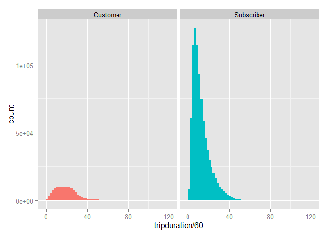
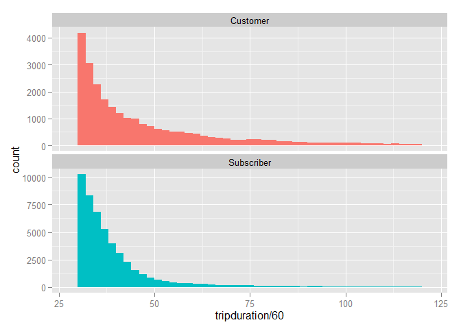
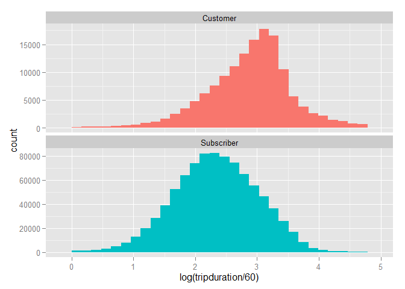
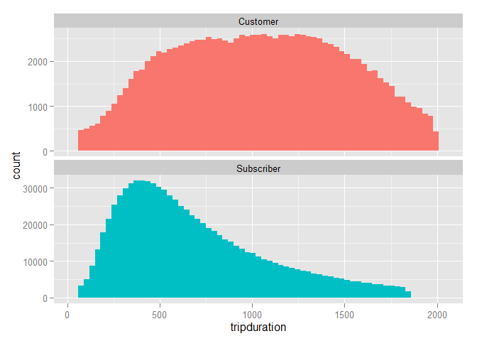
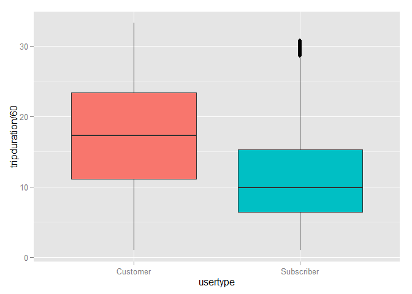
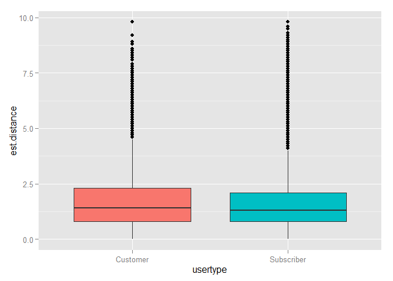

# cb_eda
Joe Willage  
November 18, 2015  


```
## 
## Attaching package: 'dplyr'
## 
## The following objects are masked from 'package:lubridate':
## 
##     intersect, setdiff, union
## 
## The following objects are masked from 'package:stats':
## 
##     filter, lag
## 
## The following objects are masked from 'package:base':
## 
##     intersect, setdiff, setequal, union
```

Given a trip month file, explore some of the properties

```r
#9/2013
tmp.trip <- as.data.frame(readRDS("data/Sep13tmptrip.rds"))
distancePairs <- readRDS("data/distancePairs.rds")
long <- which(tmp.trip$tripduration > 7200)
table(tmp.trip[long, ]$usertype)
```

```
## 
##   Customer Subscriber 
##       1977       1360
```

Surprisingly, we see that subscribers had bikes out for lengthy periods almost 
as much as customers. Perhaps this is due to the new-ness of the company, we
need to explore this for a later month file. 

Let's check out the remaining rows.


```r
tmp.trip.filt <- tmp.trip[tmp.trip$tripduration < 7200, ]
g <- ggplot(tmp.trip.filt, aes(x = tripduration/60))
g + geom_histogram(binwidth = 2, aes(fill = usertype)) + 
  facet_grid(. ~  usertype) + guides(fill = F)
```

 

Two things immediately jump out. First of all, there are a lot more subscriber 
trips than customers, in only the third month of the program. Unfortunately we 
don't have the data to compare unique riders. We can make a general assumption, 
like subscribers probably bike to work five days a week. Customers, on the other 
hand, we'll assume only make one round trip (two trips)  in a given month file. There are 
30 days in this file, 20 of them are working 
days (21 weekdays - 1 Labor Day holiday). So all things being even, we would 
expect 20 subscriber rides for every 2 customer rides, or 10 : 1. 


```r
users <- table(tmp.trip.filt$usertype)
users["Customer"]
```

```
## Customer 
##   143192
```

```r
users["Subscriber"]/10
```

```
## Subscriber 
##      88783
```

Although it appears from the histogram that there are many more subscribers than 
customers, under these assumptions, we see that
61.73
% of this month's unique riders are customers. Since the types of users are not 
too different, we'll scale each plot's y-axis accordingly. We will split the 
plots on two rows, instead of the same row, to further emphasize the difference 
in scale. 

The second thing that jumps out in the histogram is the x-axis and all the 
seemingly blank space on the right hand side. We filtered on trips less than 120 
minutes, but there are still trips that take much longer than the median. 


```r
g <- ggplot(subset(tmp.trip.filt, tripduration > 1800),
            aes(x = tripduration/60))
g + geom_histogram(binwidth = 2, aes(fill = usertype)) + 
  facet_wrap(~  usertype, scales = "free_y", nrow = 2) + guides(fill = F)
```

 

There are still thousands of trips in this tail that we don't want to ignore. 
Let's see how the log-transformed histogram of the original filtered data looks.


```r
g <- ggplot(tmp.trip.filt, aes(x = log(tripduration/60)))
g + geom_histogram(aes(fill = usertype)) + 
  facet_wrap(~  usertype, scales = "free_y", nrow = 2) + guides(fill = F)
```

```
## stat_bin: binwidth defaulted to range/30. Use 'binwidth = x' to adjust this.
## stat_bin: binwidth defaulted to range/30. Use 'binwidth = x' to adjust this.
```

 

Pretty normal. We'll keep this in our back pocket in case it's needed later.


```r
subs <- tmp.trip.filt$usertype == "Subscriber"
upper.bound.subs <- quantile(tmp.trip.filt[subs, "tripduration"], .95)
upper.bound.cust <- quantile(tmp.trip.filt[-subs, "tripduration"], .95)
```

In addition to taking 95%, we'll go back to plotting on the seconds scale rather
than minutes. Binwidths are 30 second intervals, giving us a pretty smooth 
curve. 


```r
tmp.trip.filt <- tmp.trip.filt %>% 
  mutate(inbounds = ifelse(usertype == "Customer", 
                           tripduration < upper.bound.cust , 
                           tripduration < upper.bound.subs)) %>%
  filter(inbounds == TRUE)


g <- ggplot(tmp.trip.filt, aes(x =tripduration))
g + geom_histogram(binwidth = 30, aes(fill = usertype)) + 
  facet_wrap(~  usertype, scales = "free_y", nrow = 2) + guides(fill = F)
```

 

Now that we've got a data set that makes sense, let's dig in further. 


```r
g <- ggplot(tmp.trip.filt, aes(y =tripduration/60, x = usertype))
g + geom_boxplot(aes(fill = usertype)) + guides(fill = F)
```

 

Subscribers ride for lesser time than customers.Makes sense. They'll typically 
know where they're going and the fastest route to get there (assuming this is a
commute). 

Let's finally look at the trip distance estimates.


```r
 trip.month <- tmp.trip %>% 
    left_join(distancePairs, by = c("start.station.id", "end.station.id")) 
#  %>%    select(start.station.id : gender, est.time, est.distance)

  trip.month$birth.year <- as.numeric(trip.month$birth.year)
  trip.month$tripduration <- as.numeric(trip.month$tripduration)
  
g <- ggplot(trip.month, aes(y = est.distance, x = usertype))
g + geom_boxplot(aes(fill = usertype)) + guides(fill = F)
```

 

Here we see subscribers are traveling shorter (estimated) distances, but it 
doesn't appear equal to the proportion of duration between user types. We'll 
perform a t-test and see if we can say that subscribers in fact ride for 
shorter distances. 


```r
s <- trip.month[subs, "est.distance"]
c <- trip.month[-subs, "est.distance"]
print(t <- t.test(s, c, var.equal = FALSE))
```

```
## 
## 	Welch Two Sample t-test
## 
## data:  s and c
## t = 1.798, df = 1881600, p-value = 0.07219
## alternative hypothesis: true difference in means is not equal to 0
## 95 percent confidence interval:
##  -0.0002723727  0.0063176410
## sample estimates:
## mean of x mean of y 
##  1.604443  1.601421
```

The difference in means is only thousandths of a mile. The p-value of 
 is much higher than the 5% value with which we could 
confidently say there is a difference in means. To be sure, we'll perform a 
similar test comparing the average trip durations.


```r
s <- tmp.trip.filt[subs, "tripduration"]
c <- trip.month[-subs, "tripduration"]
print(t <- t.test(c, s, var.equal = FALSE))
```

```
## 
## 	Welch Two Sample t-test
## 
## data:  c and s
## t = 99.038, df = 1187700, p-value < 2.2e-16
## alternative hypothesis: true difference in means is not equal to 0
## 95 percent confidence interval:
##  169.0908 175.9186
## sample estimates:
## mean of x mean of y 
##  905.0205  732.5158
```

check if tmp.trip.filt  matching up with trip.month and not matching up w boxplots
