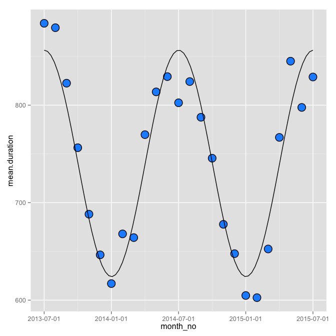
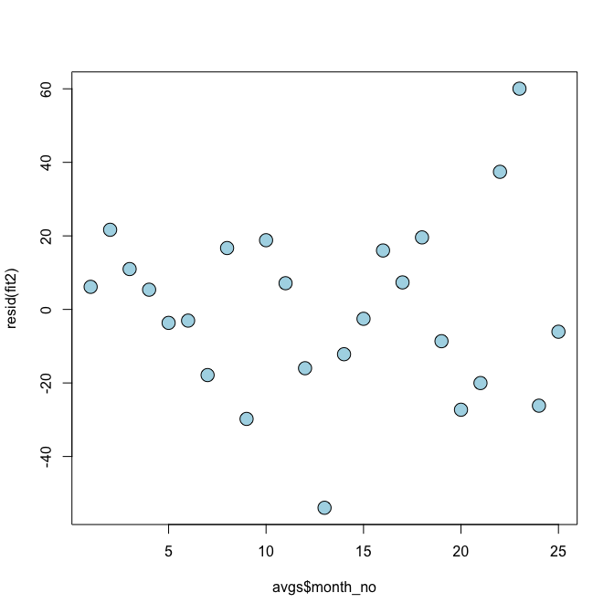
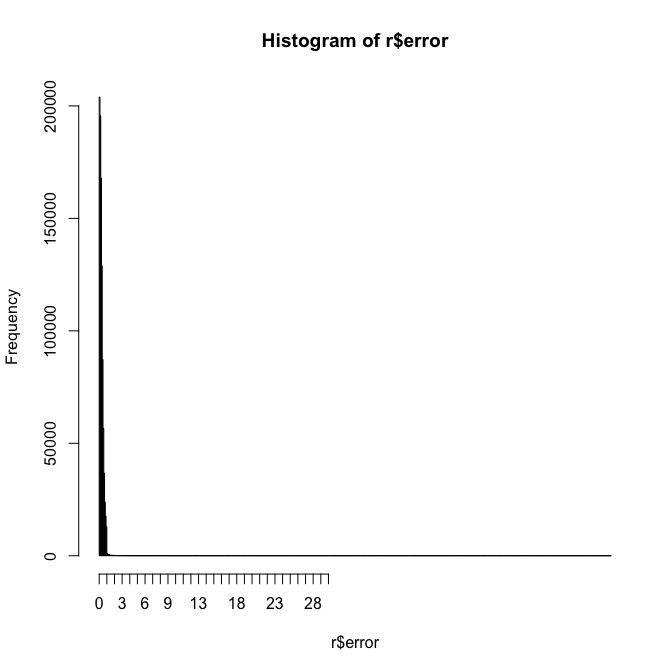
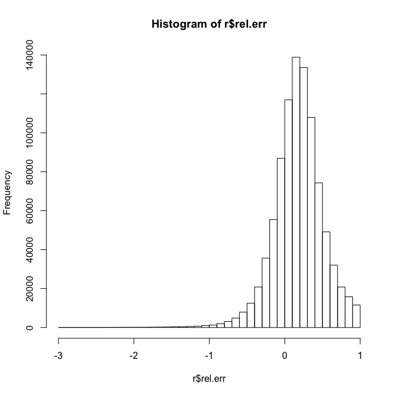

# cb_eda
Joe Willage  
November 18, 2015  


Given a trip month file, explore some of the properties

```r
source("cb_analysis.R") 
distancePairs <- readRDS("data/distancePairs.rds") 
trip.month <- processMonthTrip("2013-10-01", distancePairs)
```

```
## 
Read 36.6% of 1037712 rows
Read 59.7% of 1037712 rows
Read 85.8% of 1037712 rows
Read 1037712 rows and 15 (of 15) columns from 0.189 GB file in 00:00:05
```

```r
long <- which(trip.month$tripduration > 7200)
table(trip.month[long, ]$usertype) 
```

```
## 
##   Customer Subscriber 
##        216       2108
```

Surprisingly, we see that subscribers had bikes out for lengthy periods almost 
as much as customers. Perhaps this is due to the new-ness of the company, we
need to explore this for a later month file. 

Let's check out the remaining rows.


```r
trip.month <- trip.month[trip.month$tripduration < 7200, ]
g <- ggplot(trip.month, aes(x = tripduration/60))
g + geom_histogram(binwidth = 2, aes(fill = usertype)) + 
  facet_grid(. ~  usertype) + guides(fill = F)
```

 

Two things immediately jump out. First of all, there are a lot more subscriber 
trips than customers, in only the third month of the program. Unfortunately we 
don't have the data to compare unique riders. We can make a general assumption, 
like subscribers probably bike to work five days a week. Customers, on the other 
hand, we'll assume only make one round trip (two trips)  in a given month file. There are 
31 days in this file, 20 of them are working 
days (21 weekdays - 1 Labor Day holiday). So all things being even, we would 
expect 20 subscriber rides for every 2 customer rides, or 10 : 1. 


```r
users <- table(trip.month$usertype)
users["Customer"]
```

```
## Customer 
##    97230
```

```r
users["Subscriber"]/10
```

```
## Subscriber 
##    93815.7
```

Although it appears from the histogram that there are many more subscribers than 
customers, under these assumptions, we see that
50.89%
of this month's unique riders are customers. Since the types of users are not 
too different, we'll scale each plot's y-axis accordingly. We will split the 
plots on two rows, instead of the same row, to further emphasize the difference 
in scale. 

The second thing that jumps out in the histogram is the x-axis and all the 
seemingly blank space on the right hand side. We filtered on trips less than 120 
minutes, but there are still trips that take much longer than the median. 


```r
g <- ggplot(subset(trip.month, tripduration > 1800),
            aes(x = tripduration/60))
g + geom_histogram(binwidth = 2, aes(fill = usertype)) + 
  facet_wrap(~  usertype, scales = "free_y", nrow = 2) + guides(fill = F)
```

 

There are still thousands of trips in this tail that we don't want to ignore. 
Let's see how the log-transformed histogram of the original filtered data looks.


```r
g <- ggplot(trip.month, aes(x = log(tripduration/60)))
g + geom_histogram(aes(fill = usertype)) + 
  facet_wrap(~  usertype, scales = "free_y", nrow = 2) + guides(fill = F)
```

```
## stat_bin: binwidth defaulted to range/30. Use 'binwidth = x' to adjust this.
## stat_bin: binwidth defaulted to range/30. Use 'binwidth = x' to adjust this.
```

 

Pretty normal. We'll keep this in our back pocket in case it's needed later.


```r
subs <- trip.month$usertype == "Subscriber"
upper.bound.subs <- quantile(trip.month[subs, "tripduration"], .95)
upper.bound.cust <- quantile(trip.month[-subs, "tripduration"], .95)
```

In addition to taking 95%, we'll go back to plotting on the seconds scale rather
than minutes. Binwidths are 30 second intervals, giving us a pretty smooth 
curve. 


```r
trip.month <- trip.month %>% 
  mutate(inbounds = ifelse(usertype == "Customer", 
                           tripduration < upper.bound.cust , 
                           tripduration < upper.bound.subs)) %>%
  filter(inbounds == TRUE)

subs <- trip.month$usertype == "Subscriber"

g <- ggplot(trip.month, aes(x =tripduration))
g + geom_histogram(binwidth = 30, aes(fill = usertype)) + 
  facet_wrap(~  usertype, scales = "free_y", nrow = 2) + guides(fill = F)
```

 

Now that we've got a data set that makes sense, let's dig in further. 


```r
g <- ggplot(trip.month, aes(y =tripduration/60, x = usertype))
g + geom_boxplot(aes(fill = usertype)) + guides(fill = F)
```

 

Almost identical boxplots for both user types. 


```r
rbind(summary(trip.month[subs, "tripduration"]), 
      summary(trip.month[-subs, "tripduration"]))
```

```
##      Min. 1st Qu. Median  Mean 3rd Qu. Max.
## [1,]   60     383    595 691.9     923 1850
## [2,]   60     383    594 691.5     923 1850
```

Nary a difference. Let's finally look at the trip distance estimates.


```r
g <- ggplot(trip.month, aes(y = est.distance, x = usertype))
g + geom_boxplot(aes(fill = usertype)) + guides(fill = F)
```

 

Here again we can see there's barely a difference between user types. 

Let's shift focus and explore a more recent month. 
 


```r
monthFile <- "2015-05-01"
rec.trip.month <- processMonthTrip(monthFile, distancePairs)
```

```
## 
Read 32.2% of 961986 rows
Read 41.6% of 961986 rows
Read 53.0% of 961986 rows
Read 61.3% of 961986 rows
Read 76.9% of 961986 rows
Read 90.4% of 961986 rows
Read 961986 rows and 15 (of 15) columns from 0.173 GB file in 00:00:08
```

```r
summary (rec.trip.month) 
```

```
##  start.station.id   end.station.id      tripduration    
##  Length:961986      Length:961986      Min.   :     60  
##  Class :character   Class :character   1st Qu.:    413  
##  Mode  :character   Mode  :character   Median :    675  
##                                        Mean   :   1000  
##                                        3rd Qu.:   1131  
##                                        Max.   :2937702  
##                                                         
##    starttime                      stoptime                  
##  Min.   :2015-05-01 00:00:11   Min.   :2015-05-01 00:03:40  
##  1st Qu.:2015-05-08 19:03:12   1st Qu.:2015-05-08 19:19:09  
##  Median :2015-05-16 12:39:25   Median :2015-05-16 12:57:27  
##  Mean   :2015-05-16 15:49:28   Mean   :2015-05-16 16:06:08  
##  3rd Qu.:2015-05-24 12:38:19   3rd Qu.:2015-05-24 13:01:24  
##  Max.   :2015-05-31 23:59:59   Max.   :2015-06-16 18:28:43  
##                                                             
##     bikeid                usertype        birth.year    
##  Length:961986      Customer  :167544   Min.   :1885    
##  Class :character   Subscriber:794442   1st Qu.:1968    
##  Mode  :character                       Median :1979    
##                                         Mean   :1976    
##                                         3rd Qu.:1985    
##                                         Max.   :1999    
##                                         NA's   :167552  
##     gender             est.time         est.distance  
##  Length:961986      Min.   :      60   Min.   :0.000  
##  Class :character   1st Qu.: 1080000   1st Qu.:0.800  
##  Mode  :character   Median : 1728000   Median :1.200  
##                     Mean   : 2066278   Mean   :1.511  
##                     3rd Qu.: 2808000   3rd Qu.:2.000  
##                     Max.   :11232000   Max.   :9.300  
##                     NA's   :17         NA's   :17
```

We can add new stations to remove the NA's


```r
unknown <- findUnknownStations(monthFile, rec.trip.month, distancePairs)
newDP <- addStations(unknown, distancePairs)
distancePairs.old <- distancePairs #keep the old one for backup
distancePairs <- newDP
```

Station additions:

*  March 2014 added 491, 530  
*  March 2015 added 255  
*  July 2015 added 3180  
*  August 2015, 90 new stations were introduced. Including a temporary [ET Bike-In Movie Valet Station.](http://citibikeblog.tumblr.com/post/127176036862/et-the-extra-terrestrial-bike-in-movie)


```r
rec.trip.month <- processMonthTrip(monthFile, distancePairs)
```

```
## 
Read 28.1% of 961986 rows
Read 38.5% of 961986 rows
Read 52.0% of 961986 rows
Read 61.3% of 961986 rows
Read 76.9% of 961986 rows
Read 90.4% of 961986 rows
Read 961986 rows and 15 (of 15) columns from 0.173 GB file in 00:00:09
```

```r
summary (rec.trip.month) 
```

```
##  start.station.id   end.station.id      tripduration    
##  Length:961986      Length:961986      Min.   :     60  
##  Class :character   Class :character   1st Qu.:    413  
##  Mode  :character   Mode  :character   Median :    675  
##                                        Mean   :   1000  
##                                        3rd Qu.:   1131  
##                                        Max.   :2937702  
##                                                         
##    starttime                      stoptime                  
##  Min.   :2015-05-01 00:00:11   Min.   :2015-05-01 00:03:40  
##  1st Qu.:2015-05-08 19:03:12   1st Qu.:2015-05-08 19:19:09  
##  Median :2015-05-16 12:39:25   Median :2015-05-16 12:57:27  
##  Mean   :2015-05-16 15:49:28   Mean   :2015-05-16 16:06:08  
##  3rd Qu.:2015-05-24 12:38:19   3rd Qu.:2015-05-24 13:01:24  
##  Max.   :2015-05-31 23:59:59   Max.   :2015-06-16 18:28:43  
##                                                             
##     bikeid                usertype        birth.year         gender     
##  Length:961986      Customer  :167544   Min.   :1885     Min.   :0.000  
##  Class :character   Subscriber:794442   1st Qu.:1968     1st Qu.:1.000  
##  Mode  :character                       Median :1979     Median :1.000  
##                                         Mean   :1976     Mean   :1.019  
##                                         3rd Qu.:1985     3rd Qu.:1.000  
##                                         Max.   :1999     Max.   :2.000  
##                                         NA's   :167552                  
##     est.time         est.distance   
##  Min.   :   1.000   Min.   : 0.000  
##  1st Qu.:   5.000   1st Qu.: 0.800  
##  Median :   8.000   Median : 1.200  
##  Mean   :   9.773   Mean   : 1.511  
##  3rd Qu.:  13.000   3rd Qu.: 2.000  
##  Max.   :3300.000   Max.   :10.500  
##  NA's   :1
```

Let's remove the person who had their bike out for 34 days, and any other suspiciously long trips. 


```r
tail(rec.trip.month[order(rec.trip.month$tripduration),]$tripduration, 100)
```

```
##   [1]  159981  160352  160866  162182  164725  166151  166507  166511
##   [9]  167333  168118  168408  171624  171912  172065  172842  174256
##  [17]  174614  177211  179104  179632  180571  180665  182297  185188
##  [25]  185749  186103  188801  195277  197130  199467  199988  207266
##  [33]  209187  211507  214950  219650  220854  226232  226429  232199
##  [41]  232836  233028  241778  244519  250483  252507  257356  261243
##  [49]  261420  265158  265550  275128  275839  276043  276605  281049
##  [57]  303129  308198  312557  314793  332671  341082  341271  351150
##  [65]  351740  363048  365349  387883  391375  395092  404903  408733
##  [73]  419582  434762  445715  460039  467929  553644  570603  594017
##  [81]  610007  774243  777341  778894  793767  839985  846666  919930
##  [89]  929820  937482 1037885 1098333 1101269 1190825 1196056 1483307
##  [97] 1535944 1544503 2485503 2937702
```

Even the 100th longest trip of this month is close to 2 days. But instead of using the 95th 
percentile as a cutoff point, let's see what we get at the 99th. It's 
79.5025 minutes. I like that better than 95%; Not
only does it give us more data, it brings us out of 30-odd minute upper bound and into the 70's,
which isn't unreasonable since subscribers are alloted 45 minutes. An interesting note is that if we
did take the 95th percentile, that value for this month is 
35.5833333 minutes, which is actually longer than it was
in the early months of the program. 

Let's see how the average trip has changed throughout the course of the program. Here, we'll
take each month's data up to the 99th percentile. 


```r
start <- ymd("2013-07-01"); end <- ymd("2015-10-01")
months <- as.character(seq(start, end, by = "1 month"))
avgs.mat <- NULL
for (m in 1:length(months)){
  t <- processMonthTrip(months[m], distancePairs)
  #take up to the 99th quantile
  upper <- quantile(t$tripduration, .99)
  t <- subset(t, tripduration < upper)
  avgs.mat <- rbind(avgs.mat, cbind(mean(t$tripduration), mean(t$birth.year, na.rm = TRUE), 
                            mean(subset(t, gender != 0)$gender), mean(t$est.time),
                            mean(t$est.distance)))

}
```

```
## Warning: All formats failed to parse. No formats found.
```

```
## Warning: All formats failed to parse. No formats found.
```

```r
avgs <- data.frame(as.Date(months), avgs.mat)
names(avgs) <- c("month", "mean.duration", "mean.birth", "mean.gender", "mean.est.time", 
                 "mean.est.dist")
```


```r
avgs
```

```
##         month mean.duration mean.birth mean.gender mean.est.time
## 1  2013-07-01      883.9689   1975.479    1.234577     10.872144
## 2  2013-08-01      879.4790   1975.768    1.243674     10.674058
## 3  2013-09-01      822.5557   1975.710    1.246580     10.298578
## 4  2013-10-01      756.3728   1975.786    1.239890      9.991583
## 5  2013-11-01      688.2106   1975.564    1.228104      9.399494
## 6  2013-12-01      646.4815   1974.936    1.209123      8.948699
## 7  2014-01-01      616.9873   1974.818    1.194240      8.657986
## 8  2014-02-01      667.9763   1975.506    1.189961      8.624128
## 9  2014-03-01      664.1771   1975.257    1.205478      9.014798
## 10 2014-04-01      769.7727   1975.757    1.220707      9.288168
## 11 2014-05-01      813.6461   1975.936    1.230170      9.472808
## 12 2014-06-01      829.3029   1976.156    1.241103      9.571821
## 13 2014-07-01      802.4587   1976.316    1.237621      9.503078
## 14 2014-08-01      824.2131   1976.601    1.237517      9.557901
## 15 2014-09-01      787.6037   1976.495    1.237202      9.476498
## 16 2014-10-01      745.6129   1976.420    1.226394      9.307548
## 17 2014-11-01      677.7914   1976.014    1.217859      8.911049
## 18 2014-12-01      647.6923   1975.111    1.199307      8.630829
## 19 2015-01-01      604.7784   1974.968    1.185878      8.376092
## 20 2015-02-01      602.5747   1975.317    1.169509      8.210556
## 21 2015-03-01      652.5060   1975.306    1.191181      8.853545
## 22 2015-04-01      766.9550   1976.039    1.218895      9.534190
## 23 2015-05-01      845.1313   1976.253    1.234217      9.749767
## 24 2015-06-01      797.6920   1976.260    1.232606      9.603843
## 25 2015-07-01      828.9159   1976.651    1.239776      9.696822
## 26 2015-08-01      853.9381   1977.148    1.246446            NA
## 27 2015-09-01      846.2997   1977.315    1.249607            NA
## 28 2015-10-01      797.9516   1977.007    1.240997            NA
##    mean.est.dist
## 1       1.699715
## 2       1.664417
## 3       1.598738
## 4       1.542203
## 5       1.436392
## 6       1.358042
## 7       1.306798
## 8       1.302794
## 9       1.373072
## 10      1.425812
## 11      1.461471
## 12      1.480477
## 13      1.468606
## 14      1.478572
## 15      1.462858
## 16      1.427694
## 17      1.356586
## 18      1.306543
## 19      1.262697
## 20      1.230920
## 21      1.345792
## 22      1.466418
## 23      1.509320
## 24      1.487973
## 25      1.498250
## 26            NA
## 27            NA
## 28            NA
```

We're still missing values for the stations added in August 2015. Working from the opening of 
CitiBikes to July 2015 gives us 25 months of full data, and we'll download the data for the new 
stations later on. 


```r
avgs <- avgs[complete.cases(avgs),]
avgs$month_no <- as.numeric(row.names(avgs))
breaks <- seq(1, nrow(avgs), by = 6)
g <- ggplot(avgs, aes(x = month_no, y = mean.duration))
g + geom_point(size = 6, color = "black") + geom_point(size = 5, color = "dodgerblue1") +
  # geom_smooth(method = "lm", formula  = y~ns(x,df =5), se = FALSE, color = "black")
  geom_smooth(method = "lm", formula = y ~ sin(2*pi*x/12) + cos(2*pi*x/12), se = FALSE, 
              color = "black") + 
  scale_x_continuous(breaks = breaks, labels = avgs[breaks, "month"])
```

 

So there is a huge seasonal effect on ride duration, as might be expected. But setting that aside, 
it doesn't appear that the duration has changed much year over year (with only 2 years of data to 
look at). Let's regress out the seasonality and see what happens. 


```r
fit <- lm(mean.duration ~ sin(2 * pi * month_no/12) + cos(2 * pi * month_no/12), data = avgs)
plot(avgs$month_no, resid(fit), pch = 21, cex = 2,  bg = "red")
```

 

The residals show what appears to be a descending pattern over time. Let's add time in as a variable
of the regression model and see if it gives a better fit.


```r
fit2 <- lm(mean.duration ~ sin(2 * pi * month_no/12) + cos(2 * pi * month_no/12) + month_no, data = avgs)
coef(fit2)
```

```
##               (Intercept) sin(2 * pi * month_no/12) 
##                763.475925                 53.455141 
## cos(2 * pi * month_no/12)                  month_no 
##                103.240819                 -1.785164
```

```r
plot(avgs$month_no, resid(fit2), pch = 21, cex = 2,  bg = "lightblue")
```

 

```r
anova(fit, fit2)
```

```
## Analysis of Variance Table
## 
## Model 1: mean.duration ~ sin(2 * pi * month_no/12) + cos(2 * pi * month_no/12)
## Model 2: mean.duration ~ sin(2 * pi * month_no/12) + cos(2 * pi * month_no/12) + 
##     month_no
##   Res.Df   RSS Df Sum of Sq      F  Pr(>F)  
## 1     22 17141                              
## 2     21 13531  1    3610.2 5.6032 0.02761 *
## ---
## Signif. codes:  0 '***' 0.001 '**' 0.01 '*' 0.05 '.' 0.1 ' ' 1
```

```r
sumCoef <- summary(fit2)$coef
```

Adding in the month fixes the pattern in the residual plot, and it also reduces the residual sum of
squares by 3610. Looking at the coefficients, this means there is a -1.79
reduction in average seconds, each month, +/- 
1.57 seconds. Along this model, by Jaunary 2018 the 
average monthly trip time estimate would be down to 
9.15 minutes.  


```r
newx <- data.frame(month_no = 1:60)
p1 <- data.frame(predict(fit2, newdata = newx, interval = ("confidence")))
p2 <- data.frame(predict(fit2, newdata = newx, interval = ("prediction")))
p1$interval <- "confidence"
p2$interval <- "prediction"
p1$x <- newx$month_no
p2$x <- newx$month_no
dat <- rbind(p1, p2)
names(dat)[1] <- "y"
breaks <- seq(7, nrow(newx), by = 12)
labels <- paste0(2014:2018, "-01")

g <- ggplot(dat, aes(x = x, y = y))
g + geom_ribbon(aes(ymin = lwr, ymax = upr, fill = interval), alpha = 0.2) +
geom_smooth(method = "lm", formula = y ~ sin(2*pi*x/12) + cos(2*pi*x/12) + x, se = FALSE, 
              color = "black") +
geom_point(data = avgs, aes(x = month_no, y = mean.duration), size = 4) +
geom_point(data = avgs, aes(x = month_no, y = mean.duration), size = 3, color = "dodgerblue")  +  scale_x_continuous(breaks = breaks, labels = labels)
```

 

Taking a broader look at all the pairwise comparisons.


```r
panel.cor <- function(x, y, digits=2, prefix="", cex.cor) 
{
    usr <- par("usr"); on.exit(par(usr)) 
    par(usr = c(0, 1, 0, 1)) 
    r <- abs(cor(x, y)) 
    txt <- format(c(r, 0.123456789), digits=digits)[1] 
    txt <- paste(prefix, txt, sep="") 
    if(missing(cex.cor)) cex <- 0.8/strwidth(txt) 
 
    test <- cor.test(x,y) 
    # borrowed from printCoefmat
    Signif <- symnum(test$p.value, corr = FALSE, na = FALSE, 
                  cutpoints = c(0, 0.001, 0.01, 0.05, 0.1, 1),
                  symbols = c("***", "**", "*", ".", " ")) 
 
    text(0.5, 0.5, txt, cex = cex * r) 
    text(.8, .8, Signif, cex=cex, col=2) 
}
pairs(month ~ ., data = avgs, upper.panel = panel.cor)
```

 

Ignoring the perfect correlation between month and month_no, we see strong correlation between 
mean duration and the estimated Google Maps means. That serves as a good sanity check: a correlation 
of 0.9 between actual mean duration and the
estimated mean duration, and correlation of 0.91
between the mean duration and the mean estimated distance. Of course, we want to truly confirm the
estimated durations to the actual, which will allow us to use the estimated distances later down the
line. We'll want to do this on a row-by-row bassis, not over each month's mean.  

We see a strong correlation of 0.89 between 
gender and duration, which seems interesting. Also, correlations of 
0.71 between age and gender, and age and duration. 

We again see the sinusoidal pattern when looking at month by mean duration (and the estimates), but, 
oddly, gender and age as well.

Let's take a closer look at the relationship between gender and average duration. 

```r
g <- ggplot(data = avgs, aes(x = mean.gender, y = mean.duration))
g + geom_point(size = 6, color = "black") + geom_point(size = 5, color = "green") +
    geom_smooth(method = "lm", formula = y ~ x, se = FALSE, color = "black")
```

 

```r
fit <- lm(mean.duration ~ mean.gender, avgs)
print(s <- summary(fit))
```

```
## 
## Call:
## lm(formula = mean.duration ~ mean.gender, data = avgs)
## 
## Residuals:
##     Min      1Q  Median      3Q     Max 
## -85.054 -21.307   7.725  27.857  86.691 
## 
## Coefficients:
##             Estimate Std. Error t value Pr(>|t|)    
## (Intercept)  -3783.0      482.0  -7.849 5.94e-08 ***
## mean.gender   3710.0      394.9   9.396 2.45e-09 ***
## ---
## Signif. codes:  0 '***' 0.001 '**' 0.01 '*' 0.05 '.' 0.1 ' ' 1
## 
## Residual standard error: 41.53 on 23 degrees of freedom
## Multiple R-squared:  0.7933,	Adjusted R-squared:  0.7843 
## F-statistic: 88.28 on 1 and 23 DF,  p-value: 2.446e-09
```

The adjusted $R^2 = 0.7843$, not super conclusive. While we do get
a significant p-value, the standard error of 394.86 is very large. A better
analysis would be a t-test between each gender and their duration, before taking means. 


```r
gender.mat <- NULL

for (m in 1:length(months)){
  t <- processMonthTrip(months[m], distancePairs)
  t <- subset(t, tripduration < quantile(t$tripduration, .99) & gender != 0)
#  t <- subset(t, gender != 0)
  gender.mat <- rbind(gender.mat, t[, c("tripduration", "gender")])
}
```

```
## Warning: All formats failed to parse. No formats found.
```

```
## Warning: All formats failed to parse. No formats found.
```


```r
gender <- data.frame(gender.mat)
rm(gender.mat)
print(gs <- summary(gender))
```

```
##   tripduration        gender     
##  Min.   :  60.0   Min.   :1.000  
##  1st Qu.: 375.0   1st Qu.:1.000  
##  Median : 584.0   Median :1.000  
##  Mean   : 723.7   Mean   :1.231  
##  3rd Qu.: 926.0   3rd Qu.:1.000  
##  Max.   :5280.0   Max.   :2.000
```

After gathering all the trip durations and gender for each ride in the complete dataset, and having 
removed the rows with unknown gender, we can take a t-test. In the gender variable, 1 = male and 
2 = female. The mean gender is leaning much closer towards men. However, we discarded the unknown 
genders, and we cannot say with certainty that all of those removed rows were not women, for 
instance. (Also note the average trip duration is just about 12 minutes, much lower than the alloted
time for each trip).


```r
male <- subset(gender, gender == 1)
female <- subset(gender, gender == 2)
remove(gender)
par(mfrow = c(1, 2))
hist(female$tripduration); hist(male$tripduration)
```

 

```r
#Not too normal looking, but remember the log histograms from earlier?
hist(log(female$tripduration)); hist(log(male$tripduration))
```

 

We'll take a t-test on the log-transformed duration by gender


```r
t <- t.test(log(female$tripduration), log(male$tripduration))
t
```

```
## 
## 	Welch Two Sample t-test
## 
## data:  log(female$tripduration) and log(male$tripduration)
## t = 464.76, df = 7163500, p-value < 2.2e-16
## alternative hypothesis: true difference in means is not equal to 0
## 95 percent confidence interval:
##  0.1662009 0.1676086
## sample estimates:
## mean of x mean of y 
##  6.500096  6.333191
```

```r
exp(t$conf.int)
```

```
## [1] 1.180810 1.182474
## attr(,"conf.level")
## [1] 0.95
```

The t-test returns significant results: There is a true difference in trip duration between genders.
95% of the time a female rider will be about 18% longer than a male rider. Are men riding faster? Or
perhaps women are riding longer distances? Let's look at some pairs of destinations to compare men's
trips to women's. First though, we'll have to validate that our estimated distances are usable. 

We start with a single month to assess the reliability of the estimated data.


```r
distancePairs <- readRDS("data/distancePairs.rds") 
rec.trip.month <- processMonthTrip("2015-05-01", distancePairs)
```

```
## 
Read 28.1% of 961986 rows
Read 37.4% of 961986 rows
Read 47.8% of 961986 rows
Read 53.0% of 961986 rows
Read 72.8% of 961986 rows
Read 81.1% of 961986 rows
Read 95.6% of 961986 rows
Read 961986 rows and 15 (of 15) columns from 0.173 GB file in 00:00:09
```

```r
r <- rec.trip.month[rec.trip.month$start.station.id != rec.trip.month$end.station.id, ]
r <- r[, c("start.station.id", "end.station.id", "tripduration", "est.time", "est.distance")]
r$tripduration <- r$tripduration/60
r <- r %>% mutate(error = abs((tripduration - est.time)/tripduration))
summary(r)
```

```
##  start.station.id   end.station.id      tripduration         est.time     
##  Length:936140      Length:936140      Min.   :    1.00   Min.   : 1.000  
##  Class :character   Class :character   1st Qu.:    6.88   1st Qu.: 6.000  
##  Mode  :character   Mode  :character   Median :   11.15   Median : 9.000  
##                                        Mean   :   16.17   Mean   : 9.984  
##                                        3rd Qu.:   18.48   3rd Qu.:13.000  
##                                        Max.   :48961.70   Max.   :55.000  
##                                                           NA's   :1       
##   est.distance        error        
##  Min.   : 0.000   Min.   : 0.0000  
##  1st Qu.: 0.800   1st Qu.: 0.1152  
##  Median : 1.300   Median : 0.2393  
##  Mean   : 1.552   Mean   : 0.2923  
##  3rd Qu.: 2.000   3rd Qu.: 0.4059  
##  Max.   :10.500   Max.   :30.7143  
##                   NA's   :1
```

After filtering out trips that start and end at the same station, we calculate the error and see 
the summaries. The median error is around 24%, but there are some that are thousands of times off.


```r
head(r[order(r$error, decreasing = T), ], 10)
```

```
##        start.station.id end.station.id tripduration est.time est.distance
## 155621              255            467    19.416667     1320          3.7
## 130544              243            255    26.550000     1500          4.0
## 155618              255            243    26.783333     1440          4.0
## 155619              255            344    39.600000     1920          5.2
## 155622              255            467    30.633333     1320          3.7
## 155620              255            344    45.300000     1920          5.2
## 274898              314            255    48.800000     1860          5.1
## 274897              314            255    49.916667     1860          5.1
## 181753              271            523     1.166667       37          6.1
## 853190              521            337     1.100000       27          5.1
##           error
## 155621 66.98283
## 130544 55.49718
## 155618 52.76478
## 155619 47.48485
## 155622 42.09032
## 155620 41.38411
## 274898 37.11475
## 274897 36.26210
## 181753 30.71429
## 853190 23.54545
```

```r
rec.trip.month[rec.trip.month$start.station.id == 271 & rec.trip.month$end.station.id == 523, ]
```

```
##        start.station.id end.station.id tripduration           starttime
## 188906              271            523           70 2015-05-15 09:37:59
##                   stoptime bikeid   usertype birth.year gender est.time
## 188906 2015-05-15 09:39:09  17609 Subscriber       1978      1       37
##        est.distance
## 188906          6.1
```

Examining the most offensive estimate, it shows a duration of 70 seconds for a 6 mile trip. A manual 
check confirms the start and end station are indeed at midtown and Barclay's Center, 6 miles apart. 
The same holds true for the next several highest-error records. 


```r
hist(r$error, breaks = 500,  xaxt="n")
axis(1, at = seq(0, 30, by =1), labels = seq(0, 30, by = 1))
```

 

The density drops off after about 2 (= 200% error), suggesting all the remaining rows are outliers,
either due to error in the record or a faulty comparison between actual and estimated. We'll 
recalculate error on this subset, leaving off the absolute value function, to see which rows are 
massively over and massively under. 


```r
r <- r %>% mutate(rel.err = (tripduration - est.time)/tripduration)
summary(r)
```

```
##  start.station.id   end.station.id      tripduration     
##  Length:936140      Length:936140      Min.   :    1.00  
##  Class :character   Class :character   1st Qu.:    6.88  
##  Mode  :character   Mode  :character   Median :   11.15  
##                                        Mean   :   16.17  
##                                        3rd Qu.:   18.48  
##                                        Max.   :48961.70  
##                                                          
##     est.time        est.distance        error            rel.err        
##  Min.   :   1.00   Min.   : 0.000   Min.   : 0.0000   Min.   :-66.9828  
##  1st Qu.:   6.00   1st Qu.: 0.800   1st Qu.: 0.1152   1st Qu.:  0.0000  
##  Median :   9.00   Median : 1.300   Median : 0.2393   Median :  0.1843  
##  Mean   :  10.01   Mean   : 1.552   Mean   : 0.2927   Mean   :  0.1742  
##  3rd Qu.:  13.00   3rd Qu.: 2.000   3rd Qu.: 0.4059   3rd Qu.:  0.3684  
##  Max.   :3300.00   Max.   :10.500   Max.   :66.9828   Max.   :  0.9999  
##  NA's   :1                          NA's   :1         NA's   :1
```

```r
head(r[order(r$rel.err, decreasing = TRUE),], 10)
```

```
##        start.station.id end.station.id tripduration est.time est.distance
## 578856              445            339    14111.100        2          0.5
## 138749              250            253    13229.450        6          1.0
## 71109              2002            539     4357.000        2          0.2
## 438464              387            264     5544.517        3          0.5
## 133795              247            369     5209.283        3          0.5
## 624475              460            389     3086.467        2          0.3
## 402741              373            366    12981.567        9          1.2
## 195573              281            499     6812.217        5          0.6
## 295749              325            499    25599.067       19          3.1
## 432422              383            499    19847.083       15          2.7
##            error   rel.err
## 578856 0.9998583 0.9998583
## 138749 0.9995465 0.9995465
## 71109  0.9995410 0.9995410
## 438464 0.9994589 0.9994589
## 133795 0.9994241 0.9994241
## 624475 0.9993520 0.9993520
## 402741 0.9993067 0.9993067
## 195573 0.9992660 0.9992660
## 295749 0.9992578 0.9992578
## 432422 0.9992442 0.9992442
```

```r
head(r[order(r$rel.err, decreasing = FALSE),], 10)
```

```
##        start.station.id end.station.id tripduration est.time est.distance
## 155621              255            467    19.416667     1320          3.7
## 130544              243            255    26.550000     1500          4.0
## 155618              255            243    26.783333     1440          4.0
## 155619              255            344    39.600000     1920          5.2
## 155622              255            467    30.633333     1320          3.7
## 155620              255            344    45.300000     1920          5.2
## 274898              314            255    48.800000     1860          5.1
## 274897              314            255    49.916667     1860          5.1
## 181753              271            523     1.166667       37          6.1
## 853190              521            337     1.100000       27          5.1
##           error   rel.err
## 155621 66.98283 -66.98283
## 130544 55.49718 -55.49718
## 155618 52.76478 -52.76478
## 155619 47.48485 -47.48485
## 155622 42.09032 -42.09032
## 155620 41.38411 -41.38411
## 274898 37.11475 -37.11475
## 274897 36.26210 -36.26210
## 181753 30.71429 -30.71429
## 853190 23.54545 -23.54545
```

The errors close to $1$ represent trips which the rider had the bike out for an extended period of
time, up to 34 days (as seen previously). It's the rows with a high negative relative error that are
problematic. We'll also look at the theoretical speed required for these rows to hold true.


```r
problems <- r[r$rel.err < -3, ]
problems$thr.mph <- 60 * problems$est.distance / problems$tripduration 
head(problems[order(problems$thr.mph, decreasing = T),], 10)
```

```
##        start.station.id end.station.id tripduration est.time est.distance
## 181753              271            523     1.166667       37          6.1
## 853190              521            337     1.100000       27          5.1
## 750472              496            351     1.066667       24          4.3
## 931747               72             83     2.333333       42          7.5
## 929566               72            328     1.133333       21          3.5
## 260414              307            354     1.250000       20          3.2
## 515624              426            317     1.116667       20          2.8
## 39212               153            356     1.566667       20          3.7
## 393478              368           2021     1.000000       14          2.3
## 169396              264            523     1.666667       23          3.7
##           error   rel.err  thr.mph
## 181753 30.71429 -30.71429 313.7143
## 853190 23.54545 -23.54545 278.1818
## 750472 21.50000 -21.50000 241.8750
## 931747 17.00000 -17.00000 192.8571
## 929566 17.52941 -17.52941 185.2941
## 260414 15.00000 -15.00000 153.6000
## 515624 16.91045 -16.91045 150.4478
## 39212  11.76596 -11.76596 141.7021
## 393478 13.00000 -13.00000 138.0000
## 169396 12.80000 -12.80000 133.2000
```

It's safe to say no one is maintaining a speed over 20 MPH on a Citi Bike, including checking out
and parking. The "under-20" trips represent only 3 of the 490 rows here, which is due to Google Maps
distance APIs over-estimating trip time against traffic. There appears to be a pattern of the same
station id's repeating.


```r
offenders <- rbind(problems %>% group_by(end.station.id) %>% dplyr::summarize(n = n()) %>% 
             arrange(desc(n)) %>% select(station = end.station.id, n = n),
          problems %>% group_by(start.station.id) %>% dplyr::summarize(n = n()) %>% 
            arrange(desc(n)) %>% select(station = start.station.id, n = n))
head(offenders %>% group_by(station) %>% summarize(total = sum(n)) %>% arrange(desc(total)), 20)
```

```
## Source: local data frame [20 x 2]
## 
##    station total
##      (chr) (int)
## 1      279   268
## 2      151    94
## 3      316    65
## 4      152    53
## 5      224    38
## 6      268    36
## 7      376    35
## 8      351    27
## 9      306    26
## 10     250    21
## 11     426    19
## 12     147    16
## 13     259    13
## 14     264    11
## 15     315    11
## 16     337    10
## 17      82     9
## 18     255     8
## 19     303     8
## 20     348     8
```

It appears there may be data corruption leading to 
a large number of erroroneous records in these top 15 results. The top offender is station 279.


```r
s.279 <- rbind(problems %>% filter(end.station.id == 279) %>% group_by(start.station.id) %>% 
             dplyr::summarize(n = n()) %>% arrange(desc(n)) %>%  
             select(station = start.station.id, n = n),
          problems %>% filter(start.station.id == 279) %>% group_by(end.station.id) %>% 
            dplyr::summarize(n = n()) %>% arrange(desc(n)) %>% 
            select(station = end.station.id, n = n))
s.279 <- s.279 %>% group_by(station) %>% summarize(total = sum(n)) %>% arrange(desc(total))

dat.279 <- unique(distancePairs[distancePairs$start.station.id %in% s.279$station, 
                            c("start.station.latitude", "start.station.longitude"), with = FALSE])
dat.279$loc <- "start"
dat.279 <- rbind(dat.279, cbind(unique(
                                distancePairs[distancePairs$start.station.id == 279, 
                                              c("start.station.latitude", "start.station.longitude"), 
                                              with = FALSE]),
                                loc = "end"))
mymap13 <- get_map(location = "40.72417399459069,-73.98639034958494", zoom = 13, 
                   maptype = "toner-lines")
```

```
## maptype = "toner-lines" is only available with source = "stamen".
## resetting to source = "stamen"...
## Map from URL : http://maps.googleapis.com/maps/api/staticmap?center=40.72417399459069,-73.98639034958494&zoom=13&size=640x640&scale=2&maptype=terrain&sensor=false
## Information from URL : http://maps.googleapis.com/maps/api/geocode/json?address=40.72417399459069,-73.98639034958494&sensor=false
## Map from URL : http://tile.stamen.com/toner-lines/13/2411/3078.png
## Map from URL : http://tile.stamen.com/toner-lines/13/2412/3078.png
## Map from URL : http://tile.stamen.com/toner-lines/13/2413/3078.png
## Map from URL : http://tile.stamen.com/toner-lines/13/2411/3079.png
## Map from URL : http://tile.stamen.com/toner-lines/13/2412/3079.png
## Map from URL : http://tile.stamen.com/toner-lines/13/2413/3079.png
## Map from URL : http://tile.stamen.com/toner-lines/13/2411/3080.png
## Map from URL : http://tile.stamen.com/toner-lines/13/2412/3080.png
## Map from URL : http://tile.stamen.com/toner-lines/13/2413/3080.png
```

```r
inv <- readPNG("invert.png")
ggmap(mymap13, extent = "device") + 
  inset_raster(inv, xmin = -74.048, xmax = -73.928, ymin = 40.68, ymax = 40.766) +
  geom_point(aes(x = as.numeric(start.station.longitude), y = as.numeric(start.station.latitude),
                 color = loc), data = dat.279, size = 6, alpha = 0.6) +
  scale_colour_manual(values=c("blue", "red"))
```

 

It appears all the problematic trips with station 279 are starting or ending near the financial
district and Tribeca. The second highest offender is station 151.


```r
s.151 <- rbind(problems %>% filter(end.station.id == 151) %>% group_by(start.station.id) %>% 
             dplyr::summarize(n = n()) %>% arrange(desc(n)) %>%  
             select(station = start.station.id, n = n),
          problems %>% filter(start.station.id == 151) %>% group_by(end.station.id) %>% 
            dplyr::summarize(n = n()) %>% arrange(desc(n)) %>% 
            select(station = end.station.id, n = n))
s.151 <- s.151 %>% group_by(station) %>% summarize(total = sum(n)) %>% arrange(desc(total))

dat.151 <- unique(distancePairs[distancePairs$start.station.id %in% s.151$station, 
                            c("start.station.latitude", "start.station.longitude"), with = FALSE])
dat.151$loc <- "start"
dat.151 <- rbind(dat.151, cbind(unique(
                                distancePairs[distancePairs$start.station.id == 151, 
                                              c("start.station.latitude", "start.station.longitude"), 
                                              with = FALSE]),
                                loc = "end"))

ggmap(mymap13, extent = "device") + 
  inset_raster(inv, xmin = -74.048, xmax = -73.928, ymin = 40.68, ymax = 40.766) +
  geom_point(aes(x = as.numeric(start.station.longitude), y = as.numeric(start.station.latitude),
                 color = loc), 
                  data = dat.151, size = 6, alpha = 0.6)+
  scale_colour_manual(values=c("blue", "red"))
```

 

All problematic trips with station 151 are starting or ending very close by, in soho. 

These trips need to be removed from the data to get a sense of the Google Maps accuracy. 


```r
r <- r[r$rel.err > -3, ]
summary(r$rel.err)
```

```
##    Min. 1st Qu.  Median    Mean 3rd Qu.    Max.    NA's 
## -2.9860  0.0000  0.1845  0.1771  0.3684  0.9999       1
```

```r
hist(r$rel.err, breaks = 50)
```

 

```r
quantile(r$rel.err, probs = seq(0, 1, 0.025), na.rm = TRUE)
```

```
##          0%        2.5%          5%        7.5%         10%       12.5% 
## -2.98601399 -0.50000000 -0.34185304 -0.25560538 -0.19601329 -0.14911081 
##         15%       17.5%         20%       22.5%         25%       27.5% 
## -0.11111111 -0.07784431 -0.04956268 -0.02345416  0.00000000  0.02211874 
##         30%       32.5%         35%       37.5%         40%       42.5% 
##  0.04282116  0.06250000  0.08163265  0.09959072  0.11764706  0.13436863 
##         45%       47.5%         50%       52.5%         55%       57.5% 
##  0.15125136  0.16795069  0.18446602  0.20106525  0.21787709  0.23469388 
##         60%       62.5%         65%       67.5%         70%       72.5% 
##  0.25187032  0.26940639  0.28741093  0.30609098  0.32584270  0.34640523 
##         75%       77.5%         80%       82.5%         85%       87.5% 
##  0.36842105  0.39291737  0.41935484  0.44881890  0.48275862  0.52164009 
##         90%       92.5%         95%       97.5%        100% 
##  0.56834532  0.62686567  0.70573811  0.82326951  0.99985827
```

The median error is 18.4%. 
The histogram is upper bounded by the asymptotic at 1, and lower bounded
at the cutoff at -3 that was imposed. However we see almost exactly 95% of the data lies within 2
standard deviations, in what appears to be a close-to-normal distribution


```r
mean(r$rel.err, na.rm = TRUE) + c(-1, 1) * 1.96 * sd(r$rel.err, na.rm = TRUE)
```

```
## [1] -0.4648839  0.8191754
```

While this does illuminate the problems of bad data, the relative error is a poor measure of 
prediction accuracy. It is asymmetric and biased, effectively weighting over-estimates much more 
than under-estimates. This has to do with the fact that the equation puts an upper bound asymptotic
at 1, while the lower is unbounded. Changing the denominator to the predicted value yields the same
problem in the opposite direction. Here, the choice is to use the Balanced Relative Error (Miyazaki 
et al. 1991), which compares against both over and under-estimation. We lose no fidelity of 
magnitude, as it combines MRE and MER (Another candidate was Ln(Q) (Tofallis 2014), which provides
good symmetry, but less interpretable results). 


```r
r <- rec.trip.month[rec.trip.month$start.station.id != rec.trip.month$end.station.id, ]
r <- r[, c("start.station.id", "end.station.id", "tripduration", "est.time", "est.distance")]
r$tripduration <- r$tripduration/60
r <- r[complete.cases(r), ]
r$BRE <- (r$tripduration - r$est.time)/pmin(r$tripduration, r$est.time)
# Positive BRE (Balanced Relative Error) indicates a trip took longer than the estimate, 
# and the coverse is also true
summary(r$BRE)
```

```
##     Min.  1st Qu.   Median     Mean  3rd Qu.     Max. 
##  -30.710    0.000    0.226    0.842    0.583 7055.000
```

```r
min <- quantile(r$BRE, 0.025)
max <- quantile(r$BRE, 0.975)
out.min <- r$BRE < min
out.max <- r$BRE > max
r <- r[!(out.min | out.max),]
hist(r$BRE, xaxt = "n")
axis(1, at = seq(-0.6, 5, by = 0.2), labels = seq(-0.6, 5, by = 0.2), las = 2)
```

 

The standard IQR estimate for outliers yields about 9% of total rows. Instead, a subset is taken 
on the middle 95%. The distribution appears to be a reasonable proxy for the actual duration of 
trips. 

